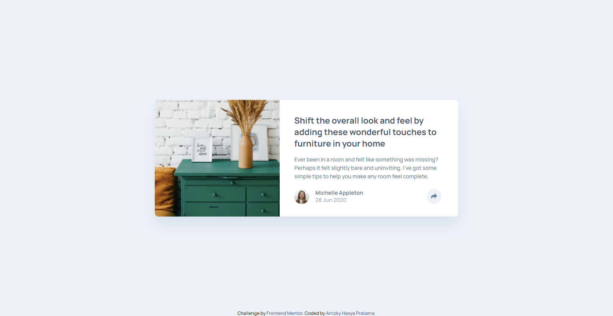

# Frontend Mentor - Article preview component solution

This is a solution to the [Article preview component challenge on Frontend Mentor](https://www.frontendmentor.io/challenges/article-preview-component-dYBN_pYFT). Frontend Mentor challenges help you improve your coding skills by building realistic projects.

## Table of contents

- [Overview](#overview)
  - [The challenge](#the-challenge)
  - [Screenshot](#screenshot)
  - [Links](#links)
- [My process](#my-process)
  - [Built with](#built-with)
  - [What I learned](#what-i-learned)
  - [Useful resources](#useful-resources)
- [Author](#author)

## Overview

### The challenge

Users should be able to:

- View the optimal layout for the component depending on their device's screen size
- See the social media share links when they click the share icon

### Screenshot


[📱 Mobile Version](./mobile.png)

### Links

- 📌 Solution URL: [Solution](https://github.com/arrizkyhp/fm-article-preview-component)
- 🎪 Live Site URL: [Live Site](https://arrizkyhp.github.io/fm-article-preview-component/)

## My process

### Built with

- CSS custom properties
- Flexbox
- CSS Grid
- BEM naming
- [Sass](https://sass-lang.com/) - CSS extension
- [GulpJS](https://gulpjs.com/) - JS library
- [ReactJS](https://reactjs.org/) - JS library

### What I learned

As always by doing each challenge i learn something new,i think this is the first challenge using JavaScript, especially learning to use react js.

I learned about how to create a "tooltip" menu, it's not easy for me because it's my first time doing that, i spend hours trying to figure out how to make tooltip menu in react 🤣

i learned that in react there's React Portal that help element to move at the <body>, it prepends the "tooltip" cut by the parent element overflow: hidden [1]

```jsx
import ReactDom from "react-dom";

const Baloon = (props) => {
  return ReactDom.createPortal(props.children, document.body);
};

export default Baloon;
```

im also learned how to make click outside to close using react hook [2]

im still fail on positiong of the tooltip, maybe in the future i can fix it 😅

### Useful resources

- [React toggle class](https://reactgo.com/react-toggle-class/) - This helped me to handle click button.
- [Learn React portals by example](https://blog.logrocket.com/learn-react-portals-by-example/) - [1]This helped me to use react portals.
- [Click Outside to Close - React Hook | Ryan Toronto](https://www.youtube.com/watch?v=eWO1b6EoCnQ) - [2] This video helped me to use click outside to close
- [css-triangle | CSS Tricks](https://css-tricks.com/snippets/css/css-triangle/) - This helped me to make tringle on tooltips menu.
- [Transitions on the CSS display property](https://stackoverflow.com/questions/3331353/transitions-on-the-css-display-property) - This helped me to know the difference between display: none & visibility: hidden and how to animate it.
- [Short note on aria-label, aria-labelledby, and aria-describedby](https://www.tpgi.com/short-note-on-aria-label-aria-labelledby-and-aria-describedby/) - This helped me to knows more about aria
- [Toggle Buttons | Inclusive Components](https://inclusive-components.design/toggle-button/) - This helped me to knows more about toggle buttons

## Author

- Github - [arrizkyhp](https://github.com/arrizkyhp)
- Frontend Mentor - [@arrizkyhp](https://www.frontendmentor.io/profile/arrizkyhp)
- Twitter - [@arrizkyhp](https://twitter.com/arrizkyhp)
